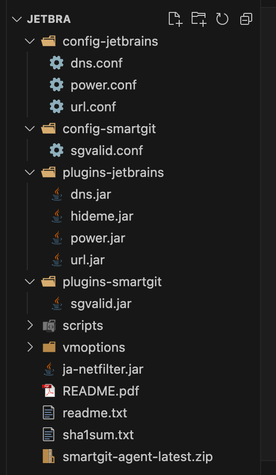

# java-netfilter
## jetbrains家族使用方法

- [zip](/jetbrain.zip) 可以用我修改好的。可以省去不少修改操作

1. 下载 [jetbra.zip](https://jb.xiaoxt.online/)（激活码也在这链接里），我解压后的目录是 `~/jetbra`
2. 编辑对应软件的`vmoptions`配置文件

`webstrom2024.3`的配置文件路径如下

```shell
~/Library/Application\ Support/JetBrains/WebStorm2024.3/webstorm.vmoptions
```
3. 在文件末尾添加如下内容，注意替换实际路径 `username`
```shell
-javaagent:/Users/longan/jetbra/ja-netfilter.jar=jetbrains
--add-opens=java.base/jdk.internal.org.objectweb.asm=ALL-UNNAMED
--add-opens=java.base/jdk.internal.org.objectweb.asm.tree=ALL-UNNAMED
```
4. 如果使用原版zip的话需要手动修改`~/jetbra/config-jetbrains/url.conf`文件

**使用我修改过的文件可以跳过这一步**
```shell
[URL]
PREFIX,https://account.jetbrains.com/lservice/rpc/validateKey.action
PREFIX,https://account.jetbrains.com.cn/lservice/rpc/validateKey.action
```
5. 打开 `webstrom` 输入下载zip地址里面对应的激活码，激活成功

## smartgit使用方法
1. 打开或者创建如下文件
```shell
~/Library/Preferences/SmartGit/smartgit.vmoptions
```
2. 添加如下内容
```shell
-javaagent:/Users/longan/jetbra/ja-netfilter.jar=smartgit
--add-opens=java.base/jdk.internal.org.objectweb.asm=ALL-UNNAMED
--add-opens=java.base/jdk.internal.org.objectweb.asm.tree=ALL-UNNAMED
```
**参考上面`webstrom`激活方法**

如果使用我的zip文件可以跳过`3`,`4`步骤

3. 下载 [sgvalid.jar](/sgvalid.jar) 插件，放到`~/jetbra/plugins-smartgit`目录下
4. 创建`~/jetbra/config-smartgit/sgvalid.conf`文件，添加如下内容

```shell
[Methods]
REGEXP,smartgit/.*|.*|\([^;]+;Ljava/security/MessageDigest;I\)V
EQUAL,smartgit/Xt|a|(Lsmartgit/TO;Ljava/security/MessageDigest;I)V
```
5. 下载 [license.zip](/license.zip) ,打开`smartgit`选择`Help`->`Register`->`Import License`导入`license.zip`文件。激活成功

### 相关链接
- **相关插件**[github](https://github.com/mqj0712/plugin-sg-valid/releases)
- **本地下载**[这里](/sgvalid.jar)
- **插件配置文件**`/Users/longan/jetbra/config-smartgit/sgvalid.conf`
- **激活文件**[压缩包](/license.zip)

## 说明
- 下载解压目录说明


目录分为`config-appname`、`plugins-appname`

其中`appname`对应`jetbrains`、`smartgit`等。也就是说，例如我想要jetbrains家族的软件，我可以有`config-jetbrains`、`plugins-jetbrains`两个目录

然后在对应软件的`vmoptions`配置文件中添加`-javaagent:/path/to/ja-netfilter.jar=jetbrains`

### 为什么要分目录
- 因为我的jetbrains家族软件使用的插件，我在smartgit软件内不需要加载这些插件
### 如何打开调试
- 在vmoption里面加上两个参数, 可以输出ja-netfilter的debug信息
```shell
-Djanf.debug=1
-Djanf.output=2
```
- 然后启动对应软件, 如果正常的话, 在ja-netfilter.jar 同级目录下面的 logs目录里面会看到ja-netfilter的debug信息
## 配置介绍
- `vmoptions`配置文件可能找不到。因为还没有默认生成，可以自己创建一个
### 配置文件所在目录列举
- `webstrom`：`～/Library/Application\ Support/JetBrains/WebStorm2023.3/webstorm.vmoptions`
- `smartgit`：`~/Library/Preferences/SmartGit/smartgit.vmoptions`
### 使用方法
1. 找到对应app的`vmoptions`文件
2. 在文件末尾添加
```shell
-javaagent:/path/to/ja-netfilter.jar=appname
--add-opens=java.base/jdk.internal.org.objectweb.asm=ALL-UNNAMED
--add-opens=java.base/jdk.internal.org.objectweb.asm.tree=ALL-UNNAMED
```

其中`appname`对应相应的配置与插件目录`config-appname`、`plugins-appname`。例如`appname`这里可以是`jetbrains`，`smartgit`

## QA

- **新版有时区选择的问题**

新版无法激活。原因是如果选择中国区，域名是一个中国的新域名

解决方案：url插件配置里面添加一个url。参考`webstrom`激活


> 原文[链接](https://zhile.io/2024/09/05/jetbrains-2024-2-region.html)


## 鸣谢

> [zhile](https://zhile.io/2020/03/27/smartgit-license-crack.html)、[linux.do](https://linux.do/t/topic/43765/75)
